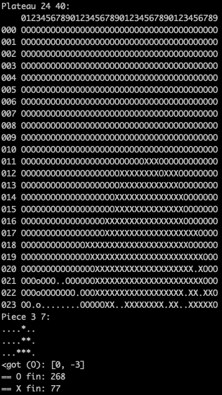

# Filler - A tetris like game where champions battle eachother on a N x N grid.

 </br>
<em>Summary:
Filler is an algorithmic game which consists in filling a grid of a known size in advance
with pieces of random size and shapes, without the pieces being stacked more than one
square above each other and without them exceeding the grid. If one of these conditions
is not met, the game stops.
Each successfully placed piece yields a number of points, and has only one player, the
goal of the game could be to get the best score possible. However, it is with two players
that the filler takes all his interest. Each player has for the purpose of placing as many
pieces as possible while attempting to prevent his opponent from doing the same. At the
end of the game, the one with the most points wins the match...</em>
</br>
</br>

## Installation:

```
git clone https://github.com/tmeulenb/filler
cd filler && make
```

## Usage:
```
After doing the steps above you will have my champions as a executable. 
You will need to run the champion within the filler_vm located in resources.
Usage: resources/filler_vm -f path [-i | -p1 path | -p2 path] [-s | -q | -t time]

   -t  --time		set timeout in second
   -q  --quiet		quiet mode
   -i  --interactive	interactive mode(default)
   -p1 --player1	use filler binary as a first player
   -p2 --player2	use filler binary as a second player
   -f  --file		use a map file (required)
   -s  --seed		use the seed number (initialization random) (man srand)
```

## Algorithm:
```
I've written a very simple heatmap algorithm based on a BFS. 
Every position in the grid will get a level based on how far it is from the enemy.
Closest to the enemy is 1 and every step away from the enemy is +1. 
After making the heatmap I bruteforce all the possible placements and 
calculate the scores based on the heatmap levels. A lower score is better. 
The X and Y position of the lowest score are saved and that is where I place the piece.
Player 1 = 'O' and player 2 = 'X'. Player 1 always begins.

```

## Rules
```
The game will end when no pieces can be placed anymore. The champion with the 
most points is the winner! This is what a finished game will look like in the terminal.
This was a game between my player (score: 268) and the best player provided to us by codam (score: 77).
```

</br>
</br>
